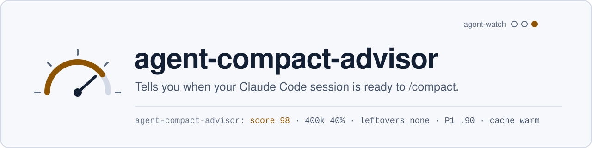

<picture>
  <source media="(prefers-color-scheme: dark)" srcset=".github/assets/banner-dark.svg">
  
</picture>


[](https://github.com/apolenkov/agent-compact-advisor/actions/workflows/ci.yml)
[](https://github.com/apolenkov/agent-compact-advisor/actions/workflows/codeql.yml)
[](https://github.com/apolenkov/agent-compact-advisor/releases)
[](LICENSE)
[](https://claude.com/claude-code)
[](https://scorecard.dev/viewer/?uri=github.com/apolenkov/agent-compact-advisor)

A Claude Code mod that tells you how good a moment it is to `/compact` now,
and why, and makes compaction safer. It never compacts by itself.

```
agent-compact-advisor: хороший момент для /compact: оценка 98 из 100 · контекст 400k (40%) · хвостов нет · цель достигнута с вероятностью 90% · кэш тёплый
agent-compact-advisor: можно подождать: оценка 50 из 100 · контекст 400k (40%) · хвосты неизвестны · кэш остыл
agent-compact-advisor: рано: идёт фоновая задача · контекст 243k (24%)
agent-compact-advisor: рано: работает 2 агента · контекст 400k (40%)
agent-compact-advisor: контекст 61% — пора компактить · рано: хвосты — ждать итоги · контекст 610k (61%)
```

## Why

- Compact too early and you throw away context you still need; too late and
  the window fills mid-task.
- Compacting while agents or background calls still run loses track of
  them.
- A compaction summary can drop the goal, decisions and open leftovers
  unless asked to keep them.

## Features

- 📊 **Status line** after every main turn, and every 30 s: a score 0–100
  and its signals.
- 🚨 **Size alert** from `alertPercent` (60) of the window, whatever the score,
  the gates or the leftovers: the line opens with "контекст 61% — пора
  компактить", one toast per crossing (it re-arms when the share drops, e.g.
  after a compaction), the `/compact` suggested at each turn end (not while
  agents or background calls run).
- 💡 **Suggestion** past the threshold (70): a ready one-line `/compact …` in
  the empty prompt box, Tab takes it; one toast when the score first crosses.
- 🔎 **Judges from the session's history**, not from the size: running
  agents, background work in classes (a poll for a merge is no obstacle), a
  runner whose result is unread, changes that no commit or push holds (asked
  of git) and the agent's own leftovers; "everything recorded" when none.
- 🛡️ **Guard**: every `/compact` and auto-compaction of the main
  conversation gets a preservation template added after your own text (goal,
  decisions, open leftovers verbatim, the owner's open question, what each
  background wait waits for, absolute file paths, verification results, what
  not to do). It never cancels a compaction.
- 🔍 **`/compact-advisor`** explains the current score part by part.

## Install

Claude Code 2.1.287+ (mods are on by default).

```
/plugin marketplace add apolenkov/agent-compact-advisor
/plugin install agent-compact-advisor@agent-compact-advisor
```

It is also listed, with its sibling mods, in the
[agent-mods](https://github.com/apolenkov/agent-mods) marketplace:

```
/plugin marketplace add apolenkov/agent-mods
/plugin install agent-compact-advisor@agent-mods
```

Or try a checkout: `claude --plugin-dir /path/to/agent-compact-advisor`.

## Usage

| Command / key      | What it does                                           |
| ------------------ | ------------------------------------------------------ |
| `/compact-advisor` | Explains the current score part by part                |
| Tab                | Takes the suggested `/compact …` from the empty prompt |

### The score

A score, not a probability: nothing is calibrated.

Gates set it to 0, and the line says which in words: no context reading yet,
context under `minTokens` (100k), running agents, live background work,
background work that hung ("stop it"), a runner that ended with its verdict
unread, changes in the repositories the session touched that no commit or push
holds (read from git), or leftovers the agent itself listed in the last answer
(unless `ignoreLeftovers`). A question to the owner (the second leftover line)
is no gate: the compaction template carries it.
Otherwise it is a weighted sum:

| Part      | Weight | Value                                                                            |
| --------- | ------ | -------------------------------------------------------------------------------- |
| fill      | 40     | from `minTokens` to `min(fullTokens, 90% of the window)`                         |
| leftovers | 30     | 1 when the last answer's leftover lines all say none                             |
| P1        | 20     | Kev's done-signal; 0 while asked; weight removed when Kev is off or down         |
| cache     | 10     | 1 within `cacheTtlMin` of the last turn (the compaction reads the cached prefix) |

It is capped at 60 while background work is unknown (agent-shell-watch not
loaded) or the last answer has no leftover lines, so a suggestion needs both
known. With `ignoreLeftovers` the leftovers part leaves the sum (the rest is
rescaled, as for an absent P1) and never gates or caps: for a coordinator
session, whose leftovers always say "wait for the others".

**Leftovers** are read from lines starting with `Хвосты для агента:` and
`Хвосты для владельца:` (the last of each counts; list marks, quotes, bold and
code are tolerated). Both prefixes and the words meaning none (`нет`, `none`)
are settings: for an English convention set `leftoverPrefixes` to `Leftovers:`.

**Words.** The status line, toasts and `/compact-advisor` use plain words, no
abbreviations, in `language`: `ru` (default, like the Russian leftover
prefixes) or `en`. A gate reads "рано: …" / "too early: …", a score at or
above `threshold` "хороший момент для /compact: оценка 82 из 100 · …", below
it "можно подождать: …".

**P1** asks Kev (System One, `kev-latest`) one question over the last answer's
final 8000 characters, on loopback only, with a 20 s timeout.

**Background calls** come from
[agent-shell-watch](https://github.com/apolenkov/agent-shell-watch)'s call list
and are told apart by what a compaction would lose with each:

- a **waiter** polls an external event (a loop that only sleeps and reads:
  `gh pr view`, `gh run watch`, `curl`, `grep`) and loses nothing: it does not
  gate, the line says how many run, and the compaction template names what each
  waits for;
- **work** (a runner, a build, any command that is not a poll, and every
  command the advisor cannot read) gates;
- **work that hung** gates as "stop it", never as "wait";
- a call that finished never counts, except a runner whose verdict is unread.

**Unrecorded work** is read from git, not guessed from commands: the advisor
remembers the files the session's tools wrote to, and at each turn start and
after each tool that can change files asks git, in the session's directory and
in every repository of those files, for uncommitted changes and for commits not
on the upstream (or on any remote). Untracked files count only when the session
wrote them. When git says nothing the line never claims "everything recorded".

**What it cannot see.** Changes made by another process between turns show at
the next turn; files outside any repository are listed for the compaction
template but never gate; a promise made to you in prose is not detected (the
leftover lines are the only proxy); after a resume the list of written paths
starts empty, so only the session's own repository is checked; a squash-merged
branch counts as recorded only when its upstream is gone and every path it
changed matches origin's default branch as last fetched (offline, no network);
if main has changed those paths since, or the branch never had an upstream,
its commits still count as unpushed.

## Configuration

Set in `/config`.

<details>
<summary><b>All settings</b></summary>

| Setting            | Default                                     |                                                                                  |
| ------------------ | ------------------------------------------- | -------------------------------------------------------------------------------- |
| `threshold`        | 70                                          | score from which the `/compact` is suggested                                     |
| `minTokens`        | 100000                                      | below it the score is 0                                                          |
| `fullTokens`       | 300000                                      | context at which the fill part is complete                                       |
| `cacheTtlMin`      | 5                                           | minutes the prompt cache counts as warm (60 with the 1-hour cache)               |
| `systemOneUrl`     | `http://127.0.0.1:8010`                     | Kev for P1; loopback only, empty turns it off                                    |
| `kevModel`         | `kev-latest`                                | System One model                                                                 |
| `leftoverPrefixes` | `Хвосты для агента:\|Хвосты для владельца:` | `\|`-separated                                                                   |
| `noneWords`        | `нет\|none`                                 | `\|`-separated                                                                   |
| `guardCompactions` | true                                        | add the template to every compaction                                             |
| `statusLine`       | true                                        | show the score                                                                   |
| `ignoreLeftovers`  | false                                       | leftovers neither gate, cap nor count (coordinator sessions)                     |
| `modelCheck`       | true                                        | haiku reads the last answer when the rules say ready; it can only lower to early |
| `language`         | `ru`                                        | words of the status line, toasts and explanation: `ru` or `en`                   |
| `alertPercent`     | 60                                          | context share (%) that alerts regardless of score; 0 turns it off                |

</details>

## Privacy

The model check sends the last answer's final 6000 characters to haiku through
your own Claude Code session (its subscription and client; no key, no other
party), only on a turn whose answer the rules do not already hold back, and a
failure or an unclear reply leaves the rules' verdict as it is. The model can
only add the gate "the answer promises more work", never lift one. Besides
it, one network call, on loopback only: P1 posts the last answer's final 8000
characters to `systemOneUrl`. No key, no telemetry, nothing stored across
sessions. See [SECURITY.md](SECURITY.md) for what it reads and sends.

## Development

See [CONTRIBUTING.md](CONTRIBUTING.md) to work on it: `npm ci`, then
`npm run check`. Questions: [SUPPORT.md](SUPPORT.md).

Live checks run locally: `npm run eval` (headless, on your Claude login; not in CI).

`scripts/corpus.py` rebuilds the calibration corpus from the local
`~/.claude/projects` journals: for every compaction boundary, the state it
was taken at (size, leftover lines, git, live background) and what the owner
said or redid after it. The October corpus (63 boundaries, 53 observable, 4
loss incidents) found every loss at a state the gates already hold — a listed
agent leftover, a live background call, an unpushed commit — while context
size and uncommitted edits predicted nothing. That is why the gates, not the
weighted sum, carry the verdict.

## License

[MIT](LICENSE). `engine-types/claude-code.d.ts` is © Anthropic PBC and not
covered by the MIT license; see [engine-types/NOTICE.md](engine-types/NOTICE.md).
